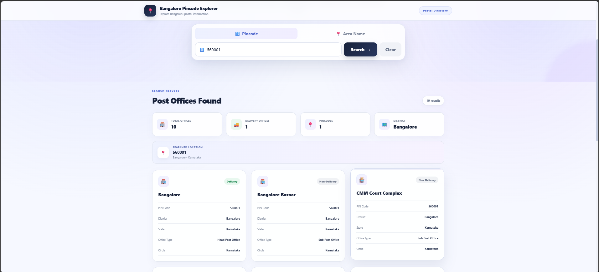

# Bangalore Pincode Explorer

A simple and responsive web application for finding post office information using a Bangalore pincode or area name.

The application fetches postal information from the India Post Pincode API and presents the results in a clean and easy-to-use interface. It also provides summary statistics such as total offices, delivery offices, pincodes and districts.

## Features

- Search post offices using a 6-digit pincode
- Search post offices using an area name
- View post office name and postal details
- Display delivery and non-delivery office status
- View pincode, district, state, office type and circle
- Summary statistics for search results
- Responsive design for desktop, tablet and mobile devices
- Separate Express.js backend for handling API requests
- Loading and error states for better user experience

## Screenshots

### Dashboard

The home screen provides the main search interface and an overview of the application.


### Search by Pincode

Users can enter a 6-digit pincode to view the available post offices and their details.



### Search by Area

Users can also search using an area name and view matching post office information.


## Tech Stack

### Frontend
- React.js
- Vite
- HTML5
- CSS3
- JavaScript

### Backend
- Node.js
- Express.js
- CORS

### API
- India Post Pincode API

### Development Tools
- Visual Studio Code
- Git
- GitHub

## How It Works

The application is divided into two main parts:

1. The React frontend provides the user interface and handles search requests.
2. The Express backend receives the request from the frontend and communicates with the India Post Pincode API.

The basic flow is:

```text
User
  ↓
React Frontend
  ↓
Express Backend
  ↓
India Post Pincode API
  ↓
Express Backend
  ↓
React Frontend
  ↓
Search Results